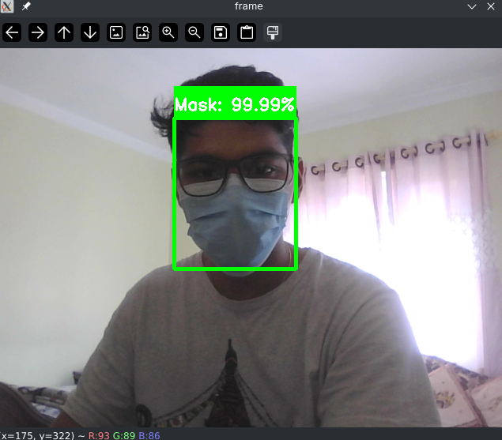

# Face-mask-detection

<div align= "center">
  <h3> Aim: To detect whether the person is wearing face mask or not </h3>
</div>

<div align= "center">
  <h4>Face Mask Detection system is built with OpenCV, Keras/TensorFlow using Deep Learning and Computer Vision concepts to detect face masks in real-time video streams.</h4>
</div>

### <a href = "https://www.kaggle.com/wobotintelligence/face-mask-detection-dataset">Dataset Source</a>

## Required Frameworks

- Tensorflow
- Keras

## Required Libraries:

- Numpy
- Sklearn
- mtcnn
- OpenCV
- Pandas
- Matplotlib
- Seaborn

## Installation guide:

- Download the zip file of this repo or clone the repo
- (optional) make a new environment
- `pip install -r requirements.txt`

## Working guide:

- Open terminal and change the directory to the downloaded unzipped folder
- Run the below command

```
python face_detection_and_classification.py
```

- Face Mask Detection will be done in real-time

## Retrain the Model

- Upload `face_mask_detection.ipynb` file on google colab
- Download the api key from kaggle
- Run all the cells

## :clap: Credits

- <a href="https://www.pyimagesearch.com/2020/05/04/covid-19-face-mask-detector-with-opencv-keras-tensorflow-and-deep-learning/">pyimagesearch</a>

## Output



